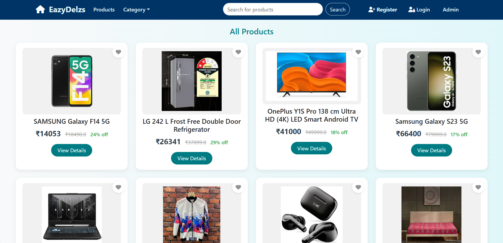

# 🛒 E-Commerce Web Application

This E-Commerce Web Application is a full-stack online shopping platform developed using Java technologies such as Servlet, JSP, JDBC, and integrated with a MySQL database. Designed for both end-users and administrators, the application ensures a smooth, interactive, and scalable online shopping experience. The goal of the project is to simulate a functional e-commerce website with real-world features for learning and demonstration purposes.

Users can register themselves, log in with their credentials, and explore a wide range of products. They can filter products by categories, perform keyword-based searches, and view detailed information about each product. If interested, users can add items to their cart or wishlist. The wishlist is accessible from the user profile, where users can manage or remove items easily. Cart management allows users to update product quantities or remove them entirely before proceeding to checkout. During checkout, users can edit their delivery address, select a preferred payment method, and place an order. Once an order is placed, users receive email confirmations and can also view order status and details from their profile section.

On the admin side, the project offers a secure admin login and dashboard. Administrators can add new product categories, upload or update products, and remove outdated listings. They are also authorized to view all orders, update their status (like shipped, delivered, etc.), and manage users including removing suspicious accounts. There is also support for creating multiple admins to manage the platform collaboratively. A key highlight of this application is its integrated email notification system. It sends out automated emails for registration confirmation, order status updates, and password recovery OTPs, ensuring users stay informed throughout their shopping journey.

Please note that the payment gateway section is created only for demonstration purposes and is not connected to any real payment system. Therefore, dummy orders can be placed without processing actual transactions.

🧰 **Tech Stack**

### 🎨 Frontend:
- **HTML5**
- **CSS3**
- **JavaScript / jQuery**
- **Bootstrap**

### ⚙️ Backend:
- **Java 17**
- **Servlet**
- **JSP (JavaServer Pages)**
- **JDBC (Java Database Connectivity)**

### 🗄️ Database:
- **MySQL 8.0**

### 🧑‍💻 Tools & Server:
- **Eclipse IDE for Enterprise Java**
- **Apache Tomcat 10**
- **MySQL Workbench**

### 📦 Dependencies / JARs Used:
- **mysql-connector-j-8.0.31**
- **angus-activation-2.0.1**
- **jakarta.activation-api-2.1.2**
- **jakarta.mail-2.0.1**
## 📸 Screenshots

### 🏠 Home Page

### 🗂️ All Products Page

### 🔐 Admin Login Page

### 📝 User Registration Page

### 🔐 User Login Page

  
